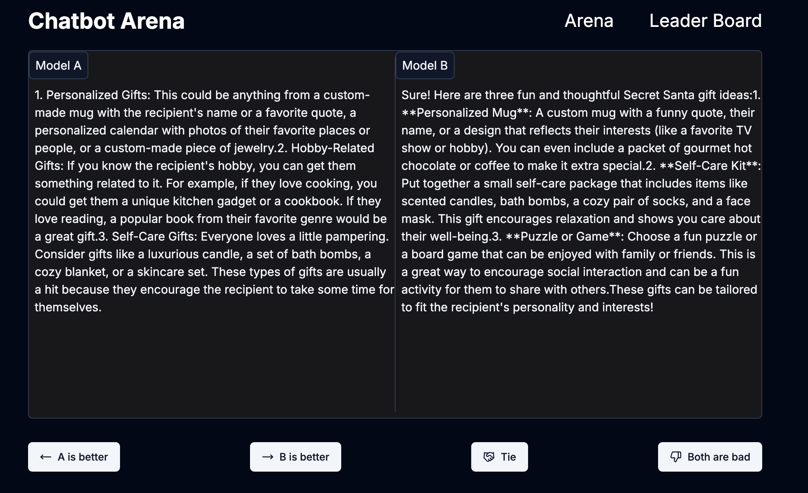

# Chatbot Arena

Chatbot Arena is a blind test platform for LLM models.


## Prerequisites
- [**Docker**](https://docs.docker.com/get-started/) and [**Docker Compose**](https://docs.docker.com/compose/): Required if you are using Docker to run the application.
## Environment Variables

To run this project, you will need to add environment variables to your .env file. Please copy and paste .env.example to .env.

## Installation
1. Ensure you have [**Docker**](https://docs.docker.com/get-started/) and [**Docker Compose**](https://docs.docker.com/compose/) installed.

2. Run the API server:
```bash
docker compose up --build
```
The server will start on 
- http://127.0.0.1:3000 (Frontend)
- http://127.0.0.1:8000/docs (Backend Swagger Document)


3. To stop the application:
```bash
docker compose down
```
## API Documentation

FastAPI automatically generates Swagger documentation. You can access it at http://127.0.0.1:8000/docs
## Screenshots
